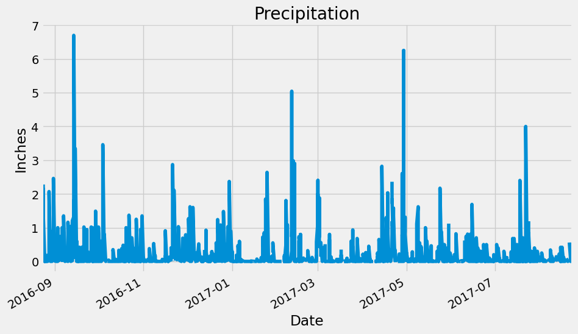
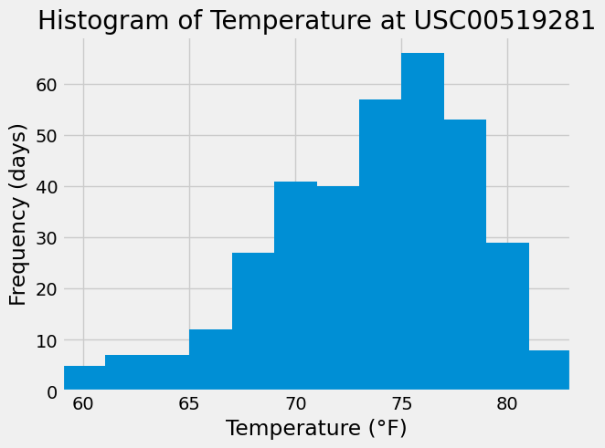

# Challenge 10 - SQLAlchemy/Flask

This challenge demonstrates the usage of SQLAlchemy 1.4 and Flask to query a database and give the query results in the form of a simple Flask API.

## Analyze Climate Data with SQLAlchemy
### Precipitation Analysis

A quick analysis of the precipitation in Hawaii for the range of dates in the data set was completed.

### Station Analysis

An analysis of temperatures at the most active station (USC00519281) was done.

---
## Simple Climate App

A small Flask app was created to serve results of the analysis queries and some of the data from the database.

The home page displays:

    Welcome
    Simple climate app of Hawaii data
    Available routes:
    /api/v1.0/precipitation
    /api/v1.0/stations
    /api/v1.0/tobs
    /api/v1.0/<start>
    /api/v1.0/<start>/<end>
    
    <start> and <end> are dates that should be in the form "YYYY-MM-DD"
    Ex: 2016-05-04
